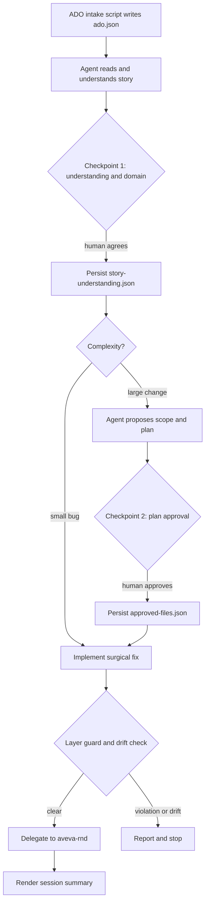
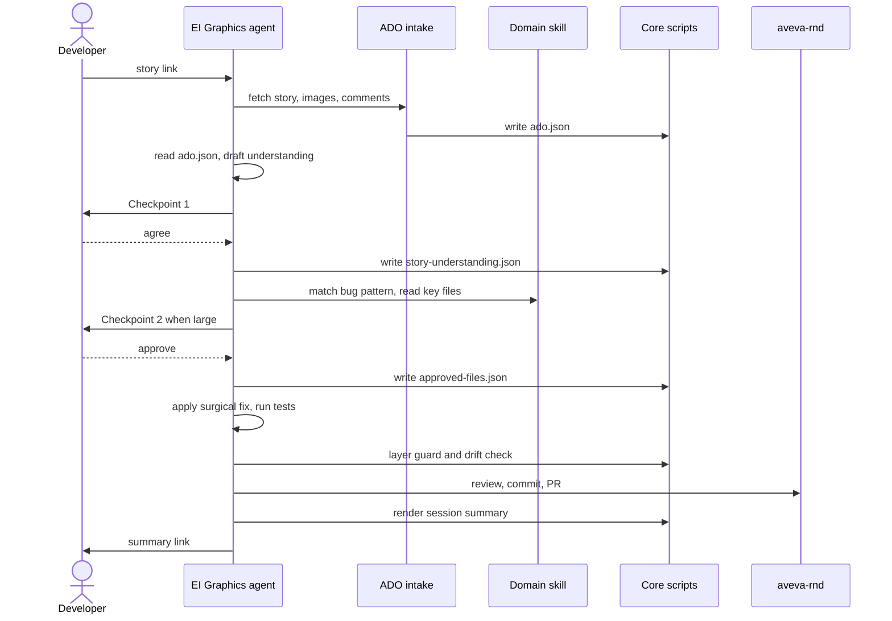
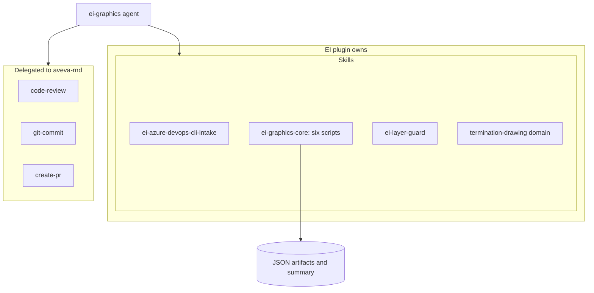
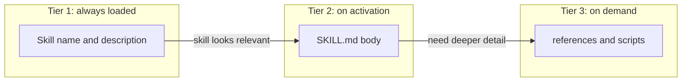
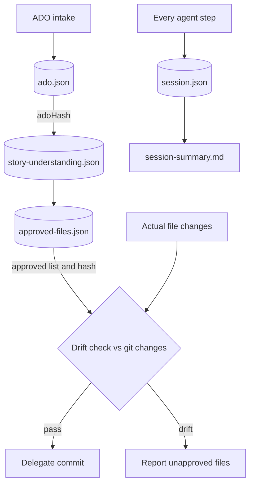

# EI Graphics plugin — how it works, in six diagrams

A visual walkthrough of the plugin as it works today. Read top to bottom: the first two diagrams
say **what** it is and **how** a story flows through it; the rest zoom into the mechanics.

Every diagram is also saved as a standalone `.mmd` file in this folder so you can drop it straight
into Excalidraw (Insert → Mermaid). The mermaid here avoids ` ` and `\n`, which Excalidraw does
not render, and uses short labels so the boxes stay legible.

---

## 1. System context — what talks to what

The plugin is a conversational agent that turns one Azure DevOps story into a verified fix. It
reads ADO but never writes back to it, edits the product code, asks a human to agree twice, and
hands review, commit and PR to `aveva-rnd`. Every step is appended to a session log.

**Key idea:** the agent does the reasoning; the skills hold the code knowledge; delivery is
delegated. Nothing in the plugin tries to reason on the agent's behalf.

---

## 2. End-to-end workflow — how a story becomes a fix

Two human checkpoints gate the run. A deterministic script fetches the story; the agent proposes;
the human confirms understanding, then approves scope. Small bugs skip straight to implementation;
large changes get a plan first.

**Key idea:** the split between deterministic scripts (intake, persistence, guards) and semantic
reasoning (understanding, scope, implementation) is deliberate. Only scripts decide pass or fail.

---

## 3. Run sequence — the same flow over time

The temporal view. Notice the agent reads `ado.json` once and never re-fetches from ADO, and that
core scripts are the only thing writing artifacts.

---

## 4. Components and ownership — what the plugin owns vs delegates

The plugin ships one agent and four skills. Review, commit and PR are read directly from
`aveva-rnd` rather than wrapped, which keeps the surface small.

**Key idea:** a domain skill like `termination-drawing` *is* the scope knowledge — no resolver
pipeline. New EI areas are added as new domain skills, one file each.

---

## 5. Progressive disclosure — how skills stay cheap to load

Skills load in three tiers so the agent only pays for what it needs. Names and descriptions are
always in context; the body loads when a skill is activated; references and scripts load only when
the task reaches for them.

**Key idea:** this is why the agent is told to work skill-first — match a documented bug pattern,
then read the skill's Key Files, and only search the wider codebase when the skill is silent.

---

## 6. Artifacts and drift — how the run stays honest

Each stage writes a schema-checked JSON artifact. Hashes chain them together: the understanding
records the hash of the ADO data it came from, and the approved file list is compared against the
real git changes before anything is committed.

**Key idea:** drift is reported, not auto-resolved. If the agent touched a file nobody approved,
the run stops and asks a human. The session log then feeds the manual skill-improvement loop.

---

## Using these in a slide or on a whiteboard

- **Excalidraw:** open a `.mmd` file, copy its contents, then in Excalidraw use *Insert → Mermaid*
  and paste. The diagrams deliberately avoid ` ` and `\n`, which that importer drops.
- **GitHub / VS Code:** this `README.md` renders every diagram inline, no tooling needed.
- Keep each diagram on its own slide. They are sized to stay readable when projected.

| File | Diagram |
|---|---|
| `01-system-context.mmd` | What talks to what |
| `02-workflow.mmd` | Story to fix, with the two checkpoints |
| `03-run-sequence.mmd` | The same flow over time |
| `04-components.mmd` | Owned vs delegated |
| `05-progressive-disclosure.mmd` | Three-tier skill loading |
| `06-artifacts-and-drift.mmd` | Artifacts, hashing and drift |
