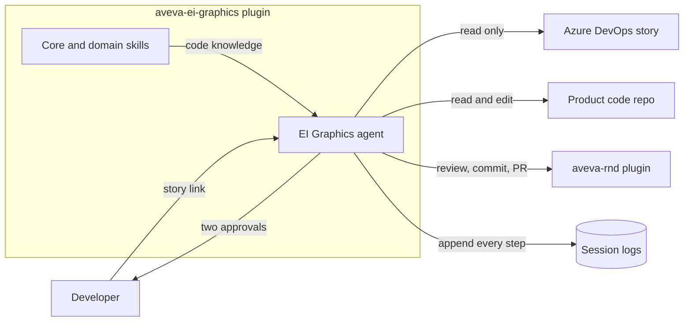
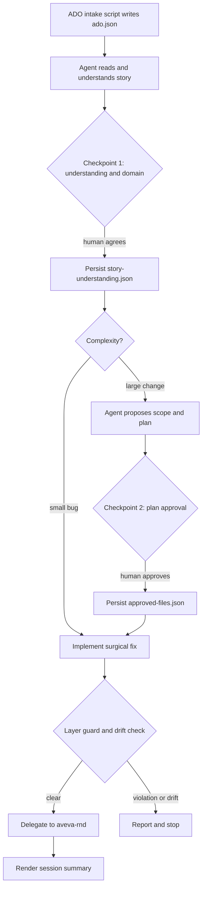
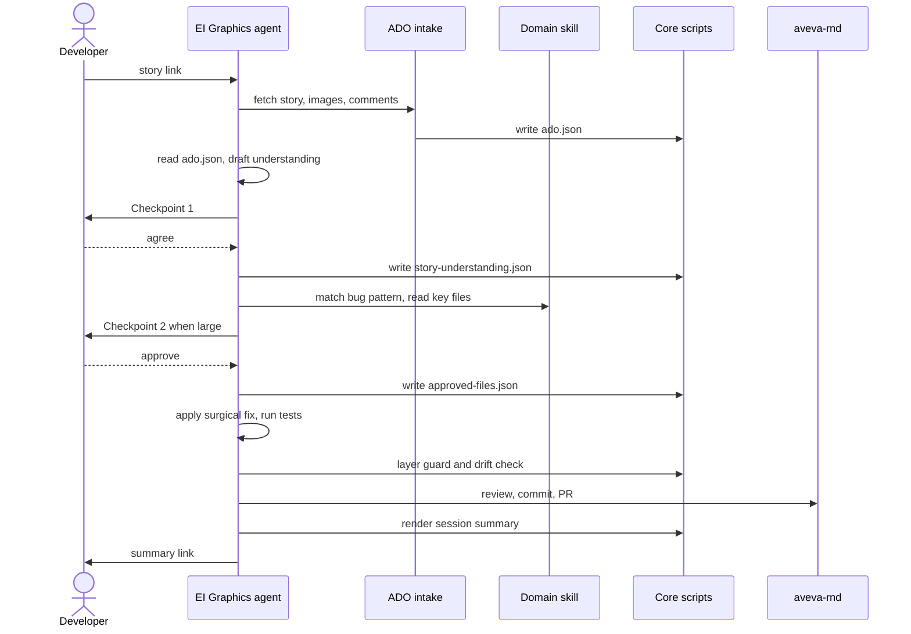
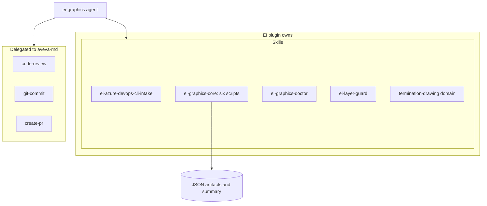
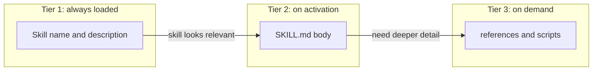
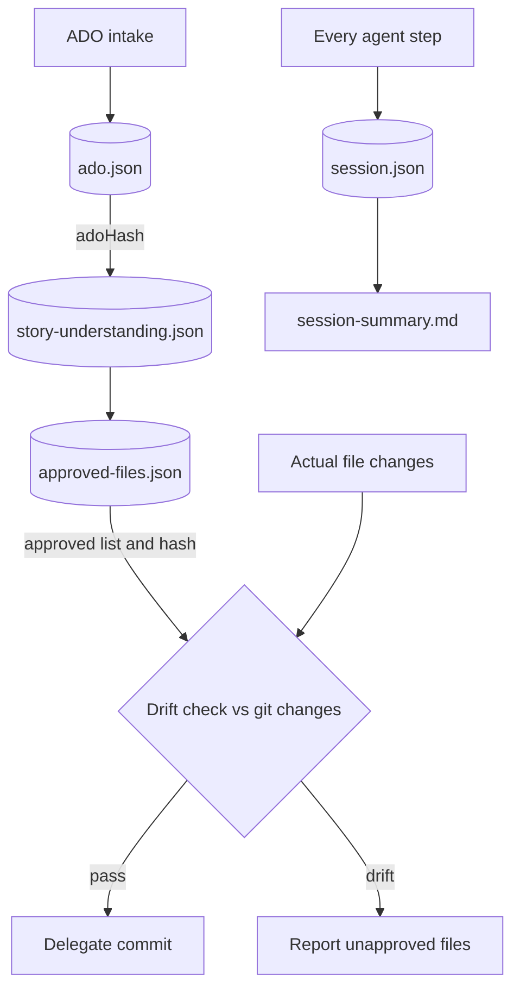
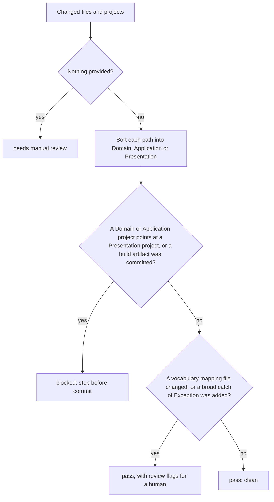
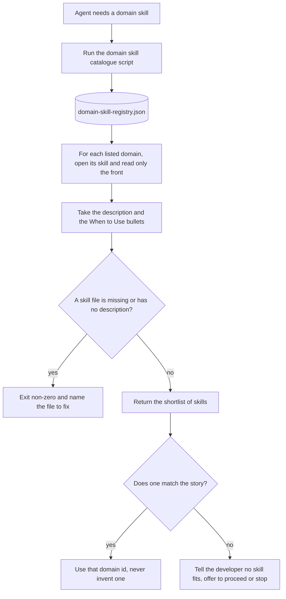

# EI Graphics plugin — how it works, in eight diagrams

A visual walkthrough of the plugin as it works today. Read top to bottom: the first two diagrams
say **what** it is and **how** a story flows through it; the rest zoom into the mechanics.

**The rendered, branded `.html` files below are the primary documentation.** Each is a
self-contained page (inline SVG, inline CSS, no build step) styled with the AVEVA brand profile —
open any of them directly in a browser. The eight `.mmd` files remain in this folder unchanged as
**importable sources**: drop one into Excalidraw (Insert → Mermaid) if you want an editable
whiteboard copy. The mermaid avoids ` ` and `\n`, which Excalidraw does not render, and uses
short labels so the boxes stay legible.

---

## 1. System context — what talks to what

**Rendered diagram:** [`01-system-context.html`](01-system-context.html)

The plugin is a conversational agent that turns one Azure DevOps story into a verified fix. It
reads ADO but never writes back to it, edits the product code, asks a human to agree twice, and
hands review, commit and PR to `aveva-rnd`. Every step is appended to a session log.

**Key idea:** the agent does the reasoning; the skills hold the code knowledge; delivery is
delegated. Nothing in the plugin tries to reason on the agent's behalf.

---

## 2. End-to-end workflow — how a story becomes a fix

**Rendered diagram:** [`02-workflow.html`](02-workflow.html)

Two human checkpoints gate the run. A deterministic script fetches the story; the agent proposes;
the human confirms understanding, then approves scope. Small bugs skip straight to implementation;
large changes get a plan first.

**Key idea:** the split between deterministic scripts (intake, persistence, guards) and semantic
reasoning (understanding, scope, implementation) is deliberate. Only scripts decide pass or fail.

---

## 3. Run sequence — the same flow over time

**Rendered diagram:** [`03-run-sequence.html`](03-run-sequence.html)

The temporal view. Notice the agent reads `ado.json` once and never re-fetches from ADO, and that
core scripts are the only thing writing artifacts.

---

## 4. Components and ownership — what the plugin owns vs delegates

**Rendered diagram:** [`04-components.html`](04-components.html)

The plugin ships one agent and five skills. Review, commit and PR are read directly from
`aveva-rnd` rather than wrapped, which keeps the surface small.

**Key idea:** a domain skill like `termination-drawing` *is* the scope knowledge — no resolver
pipeline. New EI areas are added as new domain skills, one file each.

---

## 5. Progressive disclosure — how skills stay cheap to load

**Rendered diagram:** [`05-progressive-disclosure.html`](05-progressive-disclosure.html)

Skills load in three tiers so the agent only pays for what it needs. Names and descriptions are
always in context; the body loads when a skill is activated; references and scripts load only when
the task reaches for them.

**Key idea:** this is why the agent is told to work skill-first — match a documented bug pattern,
then read the skill's Key Files, and only search the wider codebase when the skill is silent.

---

## 6. Artifacts and drift — how the run stays honest

**Rendered diagram:** [`06-artifacts-and-drift.html`](06-artifacts-and-drift.html)

Each stage writes a schema-checked JSON artifact. Hashes chain them together: the understanding
records the hash of the ADO data it came from, and the approved file list is compared against the
real git changes before anything is committed.

**Key idea:** drift is reported, not auto-resolved. If the agent touched a file nobody approved,
the run stops and asks a human. The session log then feeds the manual skill-improvement loop.

---

## 7. Layer guard — the check that runs before commit

**Rendered diagram:** [`07-layer-guard.html`](07-layer-guard.html)

The guard reads the changed files and projects, sorts each one into a layer, and returns one of
three outcomes. A lower layer reaching into the presentation layer, or a committed build artifact,
stops the run. Softer concerns become review flags a human reads but that do not block.

**Key idea:** the guard is read-only and evidence-backed. It never edits code; it decides whether
the change is safe to hand to `aveva-rnd`, and every finding names the file and what to do next.

---

## 8. Domain skill lookup — how the agent picks the right knowledge pack

**Rendered diagram:** [`08-domain-skill-lookup.html`](08-domain-skill-lookup.html)

The agent never guesses which area of the code a story touches. It runs the catalogue script, which
reads a registry and opens only the front of each skill to collect its description and its
*When to Use* bullets. The agent shortlists from that, and if nothing fits it says so plainly.

**Key idea:** reading only the front of each skill keeps the lookup cheap, and the registry is the
single source of valid domain ids. A missing or malformed skill fails loudly rather than silently
narrowing the choices.

---

---

## Using these diagrams

- **Primary use:** open the `.html` files directly in a browser, or link them from other docs —
  each is a single self-contained page (inline SVG + CSS, AVEVA brand tokens, no build step, no
  external assets besides Google Fonts).
- **Editable whiteboard copy:** the eight `.mmd` files remain importable sources.
  Open one, copy its contents, then in Excalidraw use *Insert → Mermaid* and paste. They
    deliberately avoid ` ` and `\n`, which that importer drops.
- **GitHub / VS Code:** the fenced `mermaid` blocks below each heading still render inline for a
  quick look without opening a browser, but treat the linked `.html` file as the source of truth.
- Keep each diagram on its own slide if presenting. They are sized to stay readable when projected.

| File | Diagram | Source |
|---|---|---|
| [`01-system-context.html`](01-system-context.html) | What talks to what | `01-system-context.mmd` |
| [`02-workflow.html`](02-workflow.html) | Story to fix, with the two checkpoints | `02-workflow.mmd` |
| [`03-run-sequence.html`](03-run-sequence.html) | The same flow over time | `03-run-sequence.mmd` |
| [`04-components.html`](04-components.html) | Owned vs delegated | `04-components.mmd` |
| [`05-progressive-disclosure.html`](05-progressive-disclosure.html) | Three-tier skill loading | `05-progressive-disclosure.mmd` |
| [`06-artifacts-and-drift.html`](06-artifacts-and-drift.html) | Artifacts, hashing and drift | `06-artifacts-and-drift.mmd` |
| [`07-layer-guard.html`](07-layer-guard.html) | The pre-commit check and its three outcomes | `07-layer-guard.mmd` |
| [`08-domain-skill-lookup.html`](08-domain-skill-lookup.html) | How the agent picks the right knowledge pack | `08-domain-skill-lookup.mmd` |
