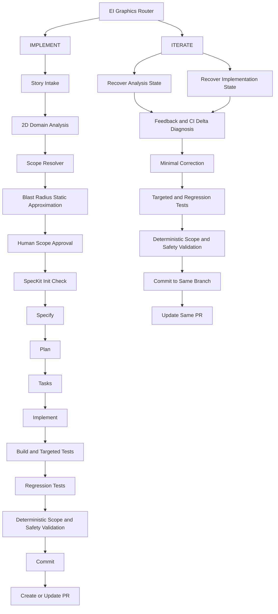

# EI Graphics Phase 1 Architecture Proposal

Date: 2026-08-11
Scope: Design and investigation only. No implementation changes were made.

## 1. Current ei-graphics architecture

### What ei-graphics is
- A plugin-level workflow for EI Graphics that currently focuses on diagnosis-to-PR readiness orchestration.
- Primary orientation is gate packaging and review readiness, not end-to-end story-to-implementation lifecycle orchestration.

### Files that define it
- Plugin metadata:
  - .github/plugin/plugin.json
- Entry agent:
  - agents/ei-graphics-workflow.agent.md
- Deterministic orchestrator:
  - agents/ei-graphics-workflow/scripts/Invoke-EiGraphicsWorkflow.ps1
- Adapted/supporting agents:
  - agents/ei-ado-ingest.agent.md
  - agents/ei-code-review.agent.md
  - agents/ei-pr-reviewer.agent.md
  - agents/ei-bug-diagnosis-to-spec.agent.md
- Skills:
  - skills/ei-azure-devops-cli-intake/SKILL.md
  - skills/ei-bug-reproducer/SKILL.md
  - skills/ei-layer-guard/SKILL.md
  - skills/ei-test-scaffolder/SKILL.md
  - skills/ei-vocabulary-navigator/SKILL.md
- Vocabulary dataset:
  - skills/ei-vocabulary-navigator/data/vocabulary-map.json

### Current inputs accepted
From agents and scripts:
- Work item URL
- Bug ID
- Description text
- Organization and project
- Keywords
- Changed files/projects/areas
- PR sanity path
- Target class/methods/test project path

### Current outputs produced
Top-level orchestrator currently returns:
- status: ready-for-pr | blocked | needs-manual-review
- summary
- evidence
- gateFindings
- prEvidencePackage
- adaptedAgents
- nextAction

### Current workflow
Current deterministic flow (from Invoke-EiGraphicsWorkflow.ps1):
1. Optional ADO ingest normalization
2. Bug reproduction context
3. Vocabulary mapping
4. Layer guard checks
5. Test scaffolding hints
6. PR reviewer gate packaging
7. Adapted code-review wrapper
8. Diagnosis-to-spec handoff payload
9. Aggregated status and evidence package

### Context/state currently preserved
- In-memory during orchestration run.
- Persisted in output object only (especially prEvidencePackage).
- No first-class persisted analysis state store for later iteration.

### Functionality to retain
- Deterministic script-based orchestration approach
- Gate classification model: blocking/advisory/manual-review
- PR evidence packaging
- ADO normalization path
- Vocabulary-assisted domain mapping
- Layer guard and minimal safety checks

### Missing capabilities for full 2D lifecycle
- Story-to-scope workflow as the primary entry path
- Mandatory human scope approval checkpoint
- Persisted analysis state for ITERATE
- Dedicated scope resolver and scope allowlist enforcement
- Deterministic diff-vs-approved-scope validation
- Automated post-approval spec->plan->tasks->implement chain
- First-class ITERATE workflow that continues same PR/branch
- First-class ApprovedScope contract reused by all downstream stages

## 2. R&D agent inventory

Relevant agents confirmed in repository:
- speckit.workflow.agent.md
- speckit.ado-ingest.agent.md
- speckit.specify.agent.md
- speckit.clarify.agent.md
- speckit.plan.agent.md
- speckit.tasks.agent.md
- speckit.analyze.agent.md
- speckit.implement.agent.md
- speckit.bugdiagnosis.agent.md
- speckit.constitution.agent.md
- speckit.git.commit.agent.md
- speckit.git.feature.agent.md
- speckit.git.validate.agent.md
- code-review.agent.md

Additional relevant findings:
- create-pr exists as a skill: skills/create-pr/SKILL.md
- No create-pr.agent.md was found under aveva-rnd/agents.

### Condensed capability profile
- speckit.workflow: orchestration/router, pre-flight checks, input classification, inline delegation.
- speckit.ado-ingest: ADO work item and hierarchy to spec.
- speckit.specify: generates spec from prompt; supports before_specify/after_specify hooks.
- speckit.clarify: ambiguity reduction workflow; supports hooks.
- speckit.plan: technical planning artifacts; supports hooks.
- speckit.tasks: dependency-ordered tasks generation; supports hooks.
- speckit.analyze: read-only cross-artifact consistency analysis; supports hooks.
- speckit.implement: task execution with checklist gates and hook support.
- speckit.bugdiagnosis: diagnosis-handoff to spec conversion.
- speckit.constitution: constitution authoring/propagation with section ownership constraints.
- git agents: initialization, feature branch creation, validation, commit automation.
- code-review agent: deterministic review protocol over changed ranges.

## 3. Agent specialization matrix

| Agent | Reuse Unchanged | Extend via Hook | Extend via Context | Wrap | Specialize/Modify | Reason |
|---|---|---|---|---|---|---|
| speckit.workflow | No | No | Partial | Yes | Optional | Router is generic. Need EI wrapper for story->2D scope->approval gate before SpecKit handoff. |
| speckit.ado-ingest | Yes | No | Yes | Optional | No | Existing ADO ingest is already deterministic and ticket-faithful. |
| speckit.specify | Yes | Yes | Yes | Optional | No | Strong for spec generation; 2D constraints can be injected via constitution/context and pre-hooks. |
| speckit.clarify | Yes | Yes | Yes | Optional | No | Clarification behavior is reusable; domain prompts/context needed. |
| speckit.plan | Yes | Yes | Yes | Optional | No | Reusable planning engine; 2D constraints and scope artifacts should be injected. |
| speckit.tasks | Yes | Yes | Yes | Optional | No | Reusable task generation; needs scoped context to avoid broad implementation drift. |
| speckit.analyze | Yes | Yes | Yes | Optional | No | Reusable quality gate; can validate scope-related artifacts via hook/context. |
| speckit.implement | Yes | Yes | Yes | Yes | No (MVP) | Reuse core executor; enforce 2D safeguards through pre/post hooks and wrapper checks. |
| speckit.bugdiagnosis | Yes | No | Yes | Yes | No | Useful for bug path and iterate diagnostics packaging. |
| speckit.constitution | Yes | Yes | Yes | Optional | No | Existing constitution mechanism already supports project-specific principles. |
| Git agents | Yes | Via existing hook wiring | Yes | Optional | No | Existing feature/commit/validate flow is sufficient for MVP. |
| code-review | Yes | No | Yes | Yes | Optional | Reusable review engine; EI wrapper should focus on 2D scope compliance and targeted regressions. |

## 4. .specify/extensions.yml analysis

### Findings
- No .specify/extensions.yml exists inside aveva-ei-graphics currently.
- One canonical scaffold exists at:
  - aveva-rnd/skills/speckit-bootstrap/scaffold/extensions.yml

### Available extension points in scaffold
- before_constitution / after_constitution
- before_specify / after_specify
- before_clarify / after_clarify
- before_plan / after_plan
- before_tasks / after_tasks
- before_implement / after_implement
- before_checklist / after_checklist
- before_analyze / after_analyze
- before_taskstoissues / after_taskstoissues

### Hook behavior model (evidence-based)
- Hooks can be mandatory (optional: false) or optional (optional: true).
- Hooks can emit EXECUTE_COMMAND instructions from multiple Speckit agents.
- Existing scaffold wires git initialize/feature/commit hooks by default.
- Hooks are checked by Speckit agents directly, so they can influence lifecycle steps without modifying agents.

### What hooks can and cannot do for 2D needs
Can do:
- Inject mandatory pre-step validations
- Trigger deterministic guard commands before/after planning and implementation
- Enforce branch/commit sequencing conventions

Cannot alone do:
- Replace full domain reasoning
- Perform deep scope inference without a dedicated resolver artifact
- Guarantee parent agent state persistence semantics across separate invocations

## 5. Verified orchestration capabilities

### Verified from repository evidence
1. Inline delegation is supported by pattern.
- speckit.workflow explicitly instructs reading another agent file and following it.
- aveva.bugdiagnosistospec.agent is a pure alias agent that delegates by reading speckit.bugdiagnosis.agent.

2. Subagent orchestration is supported in designed workflows.
- ai-ready-workflow.agent declares sub-agents, wave ordering, batching, retries, and checkpoint logic.

3. Sequential command chaining across stages is supported.
- Speckit agents include explicit stage handoffs and command patterns.
- Extension hooks provide lifecycle-stage command insertion.

4. Hook-driven deterministic execution between LLM stages is supported.
- EXECUTE_COMMAND conventions are present across Speckit agent files.

### Not fully runtime-verified in this investigation
- End-to-end live execution of a multi-agent post-approval chain in this session was not performed.
- Therefore: runtime behavior is inferred from repository-defined orchestration contracts, not from a completed live dry-run trace.

## 6. Orchestration proof-of-concept conclusion

Question-by-question outcome:
1. Can Agent A invoke Agent B?
- Yes, by inline delegation pattern and by subagent workflow patterns in repository-defined agents.

2. Can Agent B return structured information?
- Yes. Many agents and scripts define structured JSON contracts.

3. Can Agent A continue after Agent B?
- Supported by orchestrator patterns (wave/phase progression and conditional routing in agent instructions).

4. Can multiple agents execute sequentially?
- Yes (explicitly designed in workflow agents).

5. Can parent preserve state/context?
- Partially. Within one run yes; across sessions requires persisted artifacts (specs, PR evidence, branch/commits).

6. Can deterministic skills execute between stages?
- Yes via script execution and extension hook command model.

7. Can entire post-approval workflow execute automatically?
- Technically feasible by architecture, with one caveat: user-interactive handoff UX is still present in some flows, so wrapper orchestration should execute deterministic stage calls directly where required.

## 7. IMPLEMENT workflow architecture

Proposed IMPLEMENT flow:
1. ADO story URL intake
2. Story analysis
3. 2D domain analysis
4. Scope resolution
5. Dependency/blast-radius analysis
6. Human scope approval (single mandatory checkpoint)
7. SpecKit initialization check (idempotent)
8. Specify
9. Plan
10. Tasks
11. Implement
12. Build
13. Targeted tests
14. Regression tests
15. Bug-fix loop (if failures)
16. Final deterministic validation
17. Commit
18. PR creation

Automation intent:
- Everything after scope approval should be automated as supported by repository mechanisms.

## 8. ITERATE workflow architecture

Proposed ITERATE flow (same branch and same PR):
1. Recover original analysis state
2. Recover implementation state
3. Retrieve current diff and commit delta
4. Retrieve reviewer feedback and CI/test evidence
5. Diagnose incremental defect
6. Apply minimal correction only
7. Run targeted tests
8. Run regression tests
9. Run scope/safety validation
10. Commit to same branch
11. Update same PR

Diagnostic log channel:
- Domain packs may declare a log grammar consumed as structured ITERATE input.
- Termination Drawing emits tokens: MODEL-DONE, INSERT-START, BOX-ACTION,
  TERM-ACTION, WIRE-INS, CORE-INSERT, CABLE-INS, STRIP-Y, CORE-Y, plus failure
  markers fromValid=False / NO-START-POINT / FAIL.
- Parsed alongside PR threads and CI results, not in place of them.
- Path handling: log location is caller-supplied via a -DiagnosticLogPath
  parameter. No absolute or machine-specific path may appear in a domain pack,
  agent, skill, or script. Packs declare the grammar; callers declare the location.

Non-goal:
- Do not restart story->scope->plan->full-implementation unless evidence proves original scope is invalid.

## 9. SpecKit initialization strategy

Required behavior:
- Check for .specify/ in target workspace.
- If present: never reinitialize; use reconcile-safe behavior.
- If missing: prepare 2D constitution defaults, ask for confirmation, initialize once.

Feasibility evidence:
- speckit.workflow already applies init-vs-reconcile guardrails.
- speckit-bootstrap script supports safe reconcile mode and version-aware behavior.

## 10. Human scope checkpoint

Single mandatory checkpoint:
- Approval of modules/files/symbols/dependencies/risks/protected areas/expected blast radius.

Enforcement approach:
- Generate an explicit ApprovedScope artifact before entering SpecKit generation.
- Treat ApprovedScope as the scope contract reused by Specify, Plan, Tasks, Implement, and Diff Validator.

ApprovedScope conceptual object:

```text
ApprovedScope
├── story
├── domainPacks[]
├── modules[]
├── files[]
├── symbols[]
├── tests[]
├── dependencies[]
├── risks[]
├── protectedAreas[]
├── expectedChanges[]
├── blastRadius
└── approval
  ├── approvedBy
  └── timestamp
```

## 11. Analysis state model

Recommended persisted analysis state (artifact-backed, no database required for MVP):
- Story linkage metadata
- 2D domain concepts and vocabulary hits
- ApprovedScope.modules/files/symbols/tests/dependencies
- dependency and blast-radius notes (static approximation)
- risks/protected areas
- ApprovedScope.approval metadata

Primary storage options (MVP):
- PR evidence package extension
- Spec/plan artifacts under .specify
- PR description blocks

## 12. Implementation state model

Implementation state should be reconstructed from existing SCM/CI/PR systems:
- Branch name
- Commits
- Current diff
- Build/test results
- PR id/url
- review comments/threads
- CI results
- available artifacts

No new state service is required for MVP.

## 13. 2D domain knowledge strategy

### Reference pattern (evidenced)
sample_agent_with_skill demonstrates the working shape for EI domain knowledge:
- Thin agent file: workflow steps, invariants, symptom->cause table
- Fat SKILL.md: loaded on demand, holds pipeline detail, key files, code
  snippets, log grammar, bug patterns, test commands

### Decision
Adopt the split, but relocate the domain content from an agent to a skill pack.
Domain packs must not own the lifecycle.

- Domain pack = skills/ei-<domain>/SKILL.md (knowledge + invariants + tests)
- Lifecycle agent = scope -> plan -> implement -> validate -> PR
- Scope resolver selects which domain pack(s) to load per story

Rationale: one agent per subsystem produces N domains x M lifecycle stages,
each re-implementing approval and PR handling independently.

### Alternative considered and not adopted
Copying the sample agent as-is and adding approval prompts. Prompt-level
approval is advisory; it produces no checkable artifact and no diff validation.
Compare Invoke-EiPrReviewer.ps1, which blocks via exit code rather than request.

### First domain pack
Termination Drawing, sourced from sample_agent_with_skill/SKILL.md.

### Retrieval strategy
- Use targeted repository retrieval first (search/symbol/semantic + curated vocabulary).
- Avoid broad whole-repo unconstrained prompting.

## 14. Vocabulary strategy

### Current baseline
- Existing canonical-like map: skills/ei-vocabulary-navigator/data/vocabulary-map.json

### Proposed hybrid ownership
1. Automated bootstrap
- Mine candidate terms from namespaces/classes/interfaces/enums/methods/tests/docs/config.
- Include architecture terms and 2D domain candidates.

2. Human validation
- 2D SMEs review/merge/reject candidates.
- Maintain canonical map as controlled artifact.

3. Retrieval usage
- Use canonical vocabulary map for scope resolver and context injection.

### Identified gap (measured)
vocabulary-map.json contains 5 terms (cable, wiring rule, distribution board,
terminal arrangement, canvas drawing) plus 3 ambiguous terms.

Absent but documented in the sample skill pack:
LOC / level of connectivity, composite key, insertedTags, ConnectivitySide,
BackLayerShape, ShapeConnectivitySide, ConnectivityGroupKey, LocLevel.

Implication: the sample pack is the density target for vocabulary coverage.
Bootstrap mining must be seeded from domain packs, not only from
namespace/class scans.

## 15. Repository intelligence capability map

Available today:
- Text search/grep and semantic retrieval
- Symbol-level references (tooling dependent)
- Git history inspection
- Project dependency hints from csproj references
- Test discovery via naming/project patterns

Not evidenced as built-in today:
- Runtime call graph certainty

## 16. Scope resolver architecture

A dedicated 2D scope resolver is required for MVP because current workflow is PR-oriented and lacks explicit scope approval artifacts.

Scope resolver output contract should produce ApprovedScope and include:
- relevant modules
- expected files
- expected symbols
- relevant tests
- dependency notes
- blast-radius estimate (static approximation)
- protected-area constraints
- risk score

Stage wiring requirement:

```text
Scope Resolver
  ↓
ApprovedScope
  ↓
Specify
  ↓
Plan
  ↓
Tasks
  ↓
Implement
  ↓
Diff Validator
  ↓
PR
```

Domain pack selection:
- Resolver matches story text against vocabulary map and domain pack manifests
- Selected packs are recorded in ApprovedScope.domainPacks[]
- Pack invariants are copied into ApprovedScope.protectedAreas[] at approval time

## 17. Deterministic safety architecture

Minimum deterministic gates:
1. Scope guard
- Compare approved expected files/symbol scope vs actual git diff.
- Outside scope -> block or escalate.
- Core constraint: stay within the approved 2D workspace scope.

2. Final validation gate
- Build pass
- Targeted tests pass
- Regression tests pass
- Unexpected-file detection
- Protected-area checks
- basic unrelated-refactor heuristics

3. Evidence packaging
- Include gate outcomes in PR evidence package.

4. Domain invariant checks
- Each domain pack declares invariants in a machine-readable rules file.
- Diff validator evaluates them against the changed hunks, not the whole repo.
- Violation -> block, consistent with existing R-004/R-005/R-006 exit semantics.

Seed invariants (Termination Drawing, from sample pack):
- Composite key form: LOC-0 plain ID; LOC-1+ "id|{locLevel}-{side}";
  cores "coreId|{cableSide}-{connContext}"
- UpdateDrawing must construct key from metadata before insertedTagSet check
- Wire validation must route through IsTerminalInserted()
- ConnectivityGroupKey must remain in dedup predicates
- LOC-0 must sort first by LocLevel
- No insert when composite key already present in current pass
- Mutable drawing metadata must use UpdateMetadata, never AddMetadata

Note: these are grep/AST-checkable assertions. Their value depends on something
executing them, not on the model reading them.

5. Path neutrality gate
- Fail on drive-letter or user-home paths in any committed agent, skill, script,
  or domain pack: /(^|[^A-Za-z0-9])[A-Za-z]:[\\\/]/ and
  /(\$HOME|%USERPROFILE%|~\/)/
- Filesystem locations enter only as parameters or environment variables.
- Repository content is referenced by repo + ref + repo-relative path, never by
  a working-copy location.
- Applies to the diff validator and to domain pack authoring review.

## 18. Blast-radius analysis strategy

Supported approach:
- Static approximation using:
  - symbol references
  - project references
  - related tests
  - historical changes

Required labeling:
- All blast-radius outputs must be explicitly marked as static approximation, not runtime certainty.

## 19. Git-history strategy

Use git history as evidence for:
- Similar prior fixes in same components
- historically touched companion files
- test patterns and naming conventions
- commit message intent patterns

Guardrail:
- History informs decisions; it is not an auto-apply instruction source.

## 20. PR feedback handling model

Principle:
- Reviewer comments are evidence inputs, not direct prescriptions.

Evidence sources:
- PR threads
- CI/build/test results
- Domain pack diagnostic log output, where the pack declares a log grammar and
  the caller supplies the log path

Process:
1. Parse feedback into claims
2. Map claim to expected behavior
3. Validate against code/test evidence
4. isolate root cause
5. apply minimal correction
6. revalidate and republish evidence

## 21. Screenshot and attachment capabilities

Verified availability in repository ecosystem:
- ADO attachment and PR thread utilities exist in aveva-rnd skills/scripts.
- create-bug-report workflow includes screenshot/attachment handling patterns.

Not verified in this investigation:
- Live multimodal screenshot diagnosis path in ei-graphics workflow.
- Direct attachment ingestion currently wired in ei-graphics agents.

Decision:
- Mark screenshot/attachment analysis as not verified for ei-graphics MVP unless explicitly wired and tested.

## 22. MVP definition

MVP must include:
- 2D domain context injection
- one domain skill pack (Termination Drawing) with machine-readable invariants
- vocabulary-backed retrieval
- ApprovedScope contract
- human scope approval checkpoint
- deterministic scope guard
- domain invariant checks in the diff validator
- path neutrality gate
- approved 2D workspace scope enforcement
- minimal-change rules
- implementation execution via reusable SpecKit path
- targeted test execution
- regression validation
- ITERATE workflow on same PR/branch

MVP excludes:
- new databases/state services
- full platform-wide infra additions
- speculative runtime graph systems

## 23. Risks

1. Scope drift risk
- Without strict diff-vs-approved-scope checks, legacy safety degrades.

2. Over-automation risk
- Automatic chaining without hard gates can bypass intent checks.

3. Context quality risk
- Weak vocabulary/domain mapping can over-broaden implementation scope.

4. Iteration reset risk
- Without persistent analysis artifacts, ITERATE may re-run discovery unnecessarily.

## 24. Technical limitations

- No runtime proof in this session of a full live post-approval chained execution across all stages.
- Current ei-graphics implementation is oriented to PR-readiness, not full lifecycle orchestration.
- No existing first-class ApprovedScope contract in ei-graphics today.
- Screenshot/attachment diagnosis path is not verified as wired for ei-graphics.
- Automatic end-to-end agent orchestration is feasible by repository design but still requires a small non-production execution proof before Phase 3 implementation work.
- The sample agent grants write tools with no scope approval checkpoint. It is adopted as a domain-knowledge model only; its lifecycle and safety model is explicitly not adopted.

## 25. Phase 2 technical spike gates

Recommended pre-implementation sequence:
1. Phase 2A: Orchestration proof (Agent A -> Agent B -> Agent C -> structured state return)
2. Phase 2B: ApprovedScope contract proof (produce, pass through stages, validate diff against same object)
3. Phase 2C: 2D vocabulary/context proof (ADO story -> targeted module/file/symbol context), using the Termination Drawing pack as the test domain, and proving at least one invariant executes as a blocking diff check
4. Phase 2D: ITERATE state recovery proof (same branch/same PR delta-only correction path)
5. Phase 2E: Architecture review checkpoint before full implementation

Hard gate:
- Do not begin full plugin implementation until Phase 2A-2E proofs pass.

## 26. Open questions

1. Where should approved-scope artifact be persisted first in MVP?
- Candidate: extended prEvidencePackage plus a stable artifact in .specify.

2. RESOLVED (seed). Targeted test invocation follows:
   dotnet test <TestProjectPath> --filter "FullyQualifiedName~<Type>"
   where TestProjectPath is repo-relative, e.g. Tests/Aveva.EI.CanvasDrawings.Test
   Remaining: confirm regression scope and CI-equivalent invocation.

3. Should PR creation use create-pr skill directly in workflow, or remain manually triggered after evidence packaging for MVP?

4. What minimum reviewer-feedback sources are mandatory for ITERATE in MVP: PR threads only, or PR threads plus CI plus attachments?

5. RESOLVED (source identified). Canonical repo:
   dev.azure.com/AVEVA-VSTS/Dabacon Products/_git/dabacon-products
   Path: /Engineering/Modules/EI/Source
   Remaining: define ref/auth contract for deterministic scripts.
   Working-copy location is caller-supplied; no clone path is recorded here.

6. RESOLVED (ordering). Promote in this order:
   (a) model invariants -> deterministic diff checks
   (b) diagnostic log grammar -> ITERATE evidence input
   (c) symptom->cause table -> scope resolver hints
   Do not promote the sample's write-tool grant or its
   diagnose-straight-to-implement step.

## 27. Final architecture



### Component classification
- Existing R&D:
  - speckit.* core chain, git agents, code-review agent
- Extended:
  - constitution content, context injection, hook configuration at target workspace
- Wrapped:
  - EI router around pre-scope and post-approval orchestration
- Specialized:
  - 2D scope resolver and EI-specific deterministic safety checks
- New (MVP):
  - analysis-state artifact contract and scope-approval artifact
  - domain skill packs with machine-readable invariants
- Deterministic:
  - scope guard, build/test gates, diff checks, hook-executed scripts
- LLM-driven:
  - story interpretation, domain-context synthesis, clarification/planning narratives

## 28. Final decision matrix

| Question | Decision | Evidence |
|---|---|---|
| Can R&D agents be reused? | Yes, broadly reusable. | speckit chain has end-to-end spec/plan/tasks/implement capabilities and hook model. |
| Can R&D agents be extended through hooks? | Yes. | extensions.yml hook model and EXECUTE_COMMAND pattern across Speckit agents. |
| Can agents delegate to other agents? | Yes. | speckit.workflow and bugdiagnosis alias use explicit inline delegation; ai-ready-workflow uses sub-agent orchestration patterns. |
| Can IMPLEMENT be automated after scope approval? | Conditionally yes; treat as pending Phase 2A orchestration proof. | Repository supports delegation/hook patterns, but no live end-to-end proof was executed in this investigation. |
| Can ITERATE run in one turn? | Not verified yet; architecture target is yes after Phase 2D proof. | Current state artifacts are partial (prEvidencePackage + SCM/CI state), and dedicated delta-only iterate contract is not yet implemented. |
| Is SpecKit auto-initialization feasible? | Yes. | speckit.workflow pre-flight init/reconcile logic and speckit-bootstrap behavior. |
| Where is human approval required? | Mandatory at scope approval checkpoint before implementation chain. | Required safety control for legacy minimal-change objective. |
| Which R&D agents need specialization? | Primarily router/wrapper-level specialization; avoid core agent forks in MVP. | Existing Speckit agents already cover generic engineering lifecycle; missing layer is EI scope/domain/safety orchestration. |
| Which new EI agents are required? | None mandatory for MVP if wrapper + ApprovedScope + deterministic validators are added; optional dedicated scope-resolver agent can be introduced if wrapper complexity grows. | Current architecture can extend via hooks/context/wrappers first; fork/new-agent is last resort in specialization hierarchy. |
| Which safety checks are deterministic? | ApprovedScope vs git diff, build/test gates, unexpected file checks, protected-area checks, scope allowlist checks. | Existing deterministic script pattern and gate packaging model. |
| What must be deferred from MVP? | Advanced attachment/screenshot reasoning automation and non-essential infrastructure. | Not verified as currently wired in ei-graphics; keep MVP focused on safe 2D workspace-scoped change control. |

## Evidence references used

Primary files inspected:
- aveva-ei-graphics:
  - agents/ei-graphics-workflow.agent.md
  - agents/ei-graphics-workflow/scripts/Invoke-EiGraphicsWorkflow.ps1
  - agents/ei-ado-ingest.agent.md
  - agents/ei-code-review.agent.md
  - agents/ei-pr-reviewer.agent.md
  - agents/ei-bug-diagnosis-to-spec.agent.md
  - agents/ei-code-review/scripts/Invoke-EiCodeReview.ps1
  - agents/ei-pr-reviewer/scripts/Invoke-EiPrReviewer.ps1
  - skills/*/SKILL.md and vocabulary dataset
  - sample_agent_with_skill/termination-drawing.agent.md
  - sample_agent_with_skill/SKILL.md
- aveva-rnd:
  - agents/speckit.*.agent.md
  - agents/code-review.agent.md
  - agents/aveva.bugdiagnosistospec.agent.md
  - agents/ai-ready-workflow.agent.md
  - skills/speckit-bootstrap/scaffold/extensions.yml
  - skills/create-pr/SKILL.md

Status: Phase 1 design report revised and ready for Phase 2 technical spike approval.
